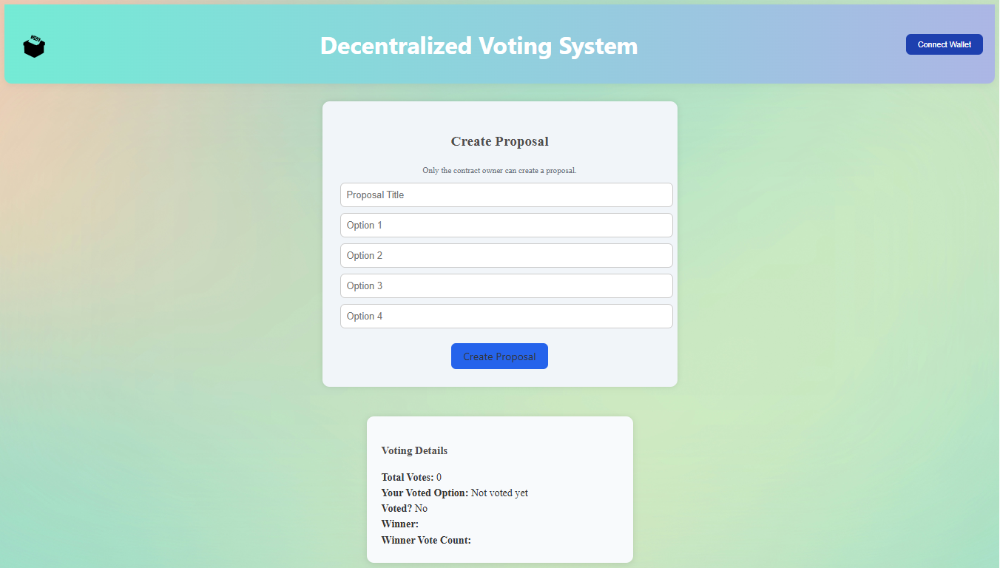
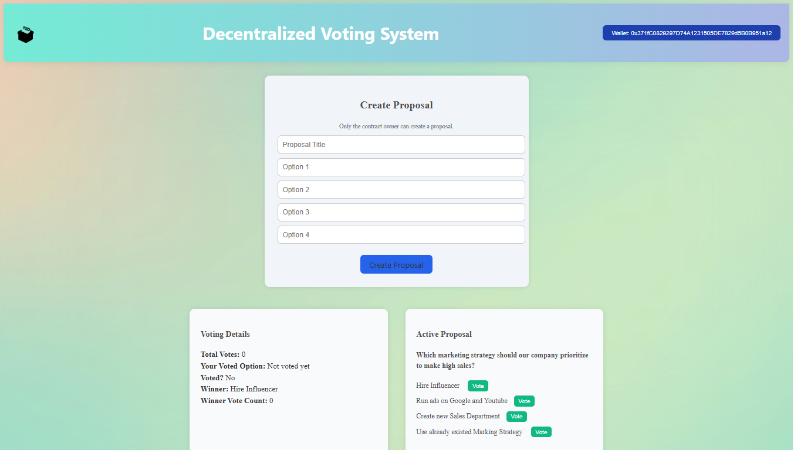
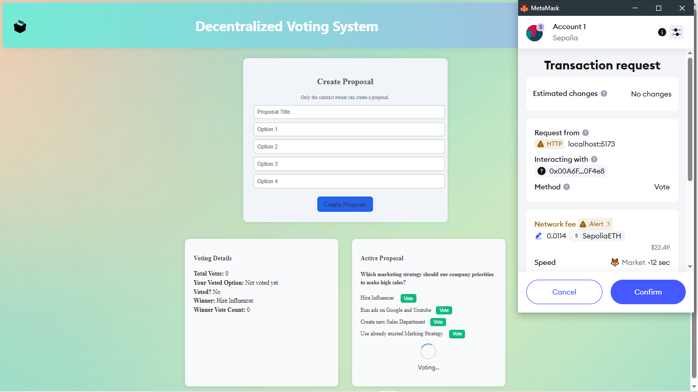
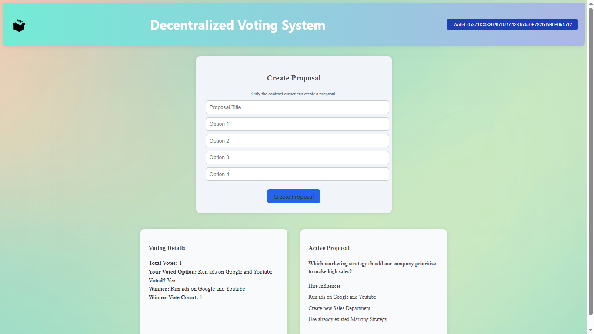

# 🗳️ Decentralized Voting System

A fully on-chain decentralized voting dApp built using **Solidity** and **React.js**. It enables users to vote on proposals, with eligibility based on holding a minimum number of ERC-20 tokens. Only the contract owner can create proposals.

---

## 📦 Tech Stack

- **Smart Contract**: Solidity ^0.8.28
- **Frontend**: React.js + Vite
- **Ethereum Library**: Ethers.js v6
- **Wallet Support**: MetaMask
- **Token Requirement**: ERC-20 Token
- **Development Tools**: Hardhat, React Toastify, Vite, etc.

---

## 🔐 Features

✅ Only contract owner can create proposals  
✅ Each proposal supports 4 voting options  
✅ Only token holders (above a minimum threshold) can vote  
✅ One vote per wallet address  
✅ Optionally fetch the winning option  
✅ Reusable for new proposals (resets previous votes)  
✅ Votes are stored on-chain for transparency

---

## 🖥️ Frontend Overview

- Connects to MetaMask
- Displays the current proposal and available options
- Shows if user already voted, and for which option
- Displays total votes and current winner
- Form to create new proposal (only for contract owner)

---

## 🛠️ Setup Instructions

### 🔧 Backend (Smart Contract)

1. Navigate to `backend/`
2. Install dependencies:

   ```bash
   npm install

   ```

3. Create a .env file:
   SEPOLIA_RPC_URL=""
   PRIVATE_KEY=""
   CONTRACT_ADDRESS_TOKEN=""
   CONTRACT_ADDRESS_VOTING=""

4. Compile Contracts:
   npx hardhat compile

5. Deploy Contracts:
   npx hardhat run scripts/deploy_ERC20.js --network <your-network>
   npx hardhat run scripts/deploy_Voting.js --network <your-network>

🌐 Frontend

1. Navigate to frontend-voting-system/

2. Install dependencies:
   npm install

3. Create a .env file:
   VITE_CONTRACT=0xYourDeployedContractAddress

4. Start the app:
   npm run dev

🤝 Contributing
Pull requests are welcome! For major changes, please open an issue first to discuss what you'd like to change.

📄 License
This project is UNLICENSED — you may use, copy, modify, and distribute this code freely.

---

## 🖼️ Screenshots

### 1. All Pages

  
  
  

